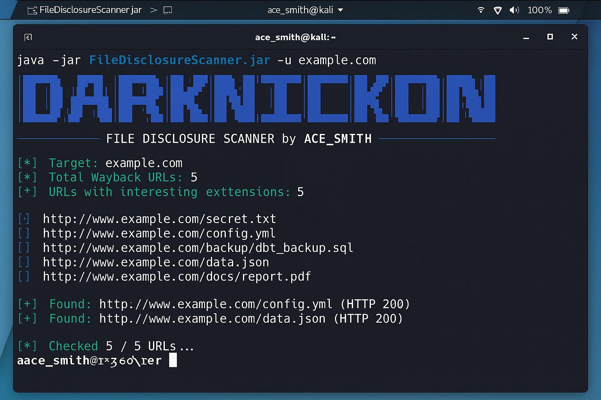

Darknickon File Disclosure Scanner is a high-performance, multithreaded Java tool designed to detect and analyze sensitive file exposures across web archives. It leverages the Wayback Machine's CDX API to retrieve historical URLs, filters them based on file extensions indicative of sensitive data (e.g., .sql, .pdf, .docx, .zip), and assesses their accessibility. This tool is invaluable for penetration testers, bug bounty hunters, and security researchers aiming to uncover inadvertent file disclosures and misconfigurations.

# 🔍 Key Features
Wayback Machine Integration: Retrieves archived URLs for a specified domain using the CDX API.

**Extension-Based Filtering**: Targets URLs ending with potentially sensitive file extensions.

*Multithreaded Scanning*: Utilizes concurrent threads to efficiently check the availability of filtered URLs.

*Status Code Evaluation*: Identifies accessible files by analyzing HTTP response codes.

**Automated Downloading**: Optionally downloads accessible files of a specified extension for further analysis.

**Customizable Parameters**: Allows users to set thread count, timeout durations, and acceptable HTTP status codes.

# 📘 Usage
bash
Copy code

*java -jar FileDisclosureScanner.jar -u <domain> [options]*
Options:

-u <domain>: Target domain (required)

-o <output.txt>: Save results to specified file

--A <ext>: Download all files with the specified extension (e.g., pdf)

--threads <n>: Number of parallel threads (default: 12)

**--timeout <ms>: HTTP timeout in milliseconds (default: 8000)**

--status <codes>: Comma-separated list of acceptable HTTP status codes (default: 200,301,302,307,308,403)

_-h, --help: Display help message_

Examples:

bash
Copy code
java -jar FileDisclosureScanner.jar -u example.com
java -jar FileDisclosureScanner.jar -u example.com -o results.txt
java -jar FileDisclosureScanner.jar -u example.com --A pdf
# 🏷️ Tags 

vulnerability-scanner

information-disclosure

file-scanner

security-tools

bugbounty

pentesting

wayback-machine

java-security

web-archive-analysis

sensitive-data-exposure

# BNB

# Binance smart chain (Network)
# 0x8bb4266573dfcfb3719611a94231f547356ba546 (address)
**discord server link** : https://discord.gg/cXxnptmw

